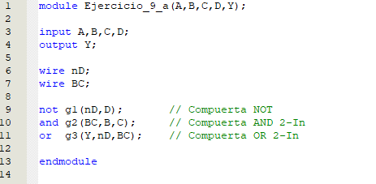
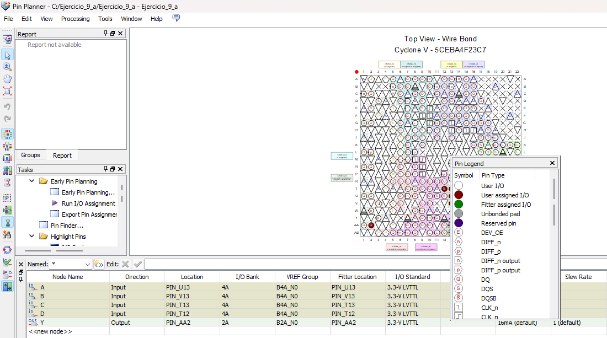
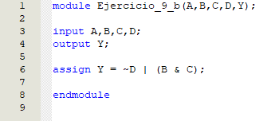
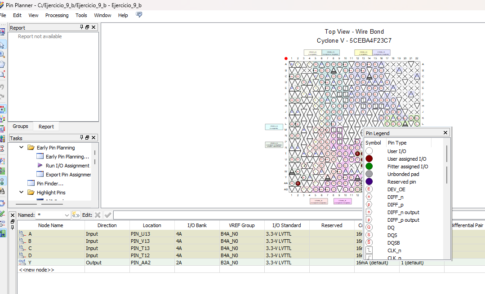
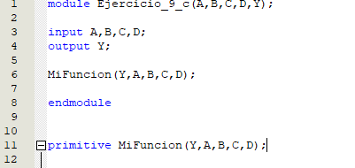
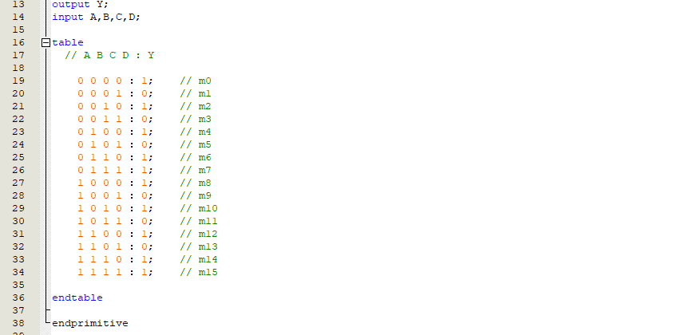
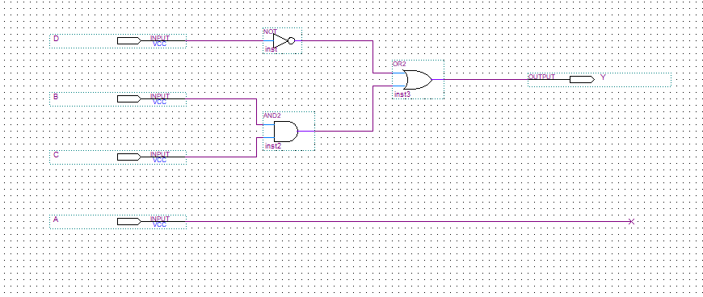
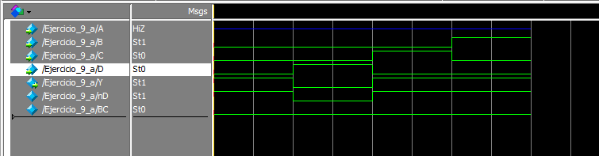

Código y Pin-planner

Punto A:

Punto B:

Punto C:

Punto D:

simulación:

El orden de las combinaciones planteadas de la simulación es: 

1- 000
2- 001
3- 010
4- 100

esos valores se asignaron respectivamente para B,C,D

[⋆Da click aquí para acceder al video con la sustentación⋆](https://youtube.com/shorts/Ze6s-AQv10A)